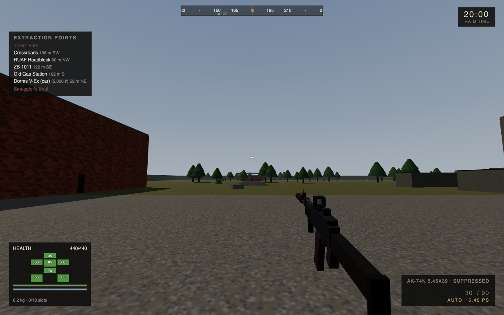
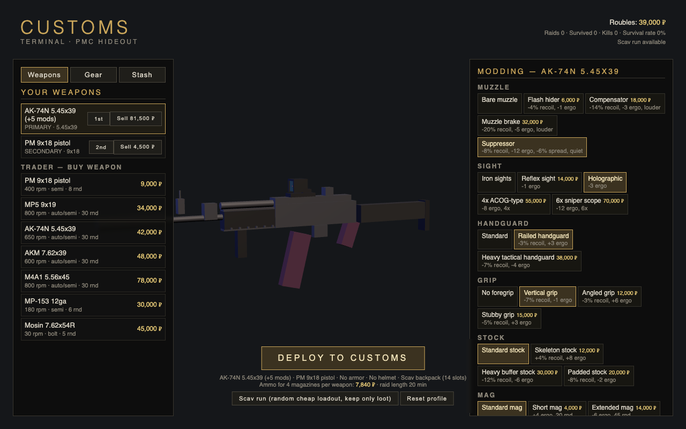

# CUSTOMS — Escape Raid

> A Tarkov-style first-person extraction shooter. **One HTML file. Zero dependencies. Written entirely by Fable 5.1.**

Open `customs.html` in a browser. That's the whole install.



## What's inside

A full extraction-raid loop, in a single self-contained file:

- **Hideout** — buy/sell gear, mod your weapons attachment-by-attachment, insure what you can't afford to lose
- **Raid on Customs** — procedurally dressed industrial map: dorms, gas station, construction, rail
- **Scav & PMC AI** — patrol, investigate, flank, suppress; they hear your shots and they come
- **Ballistics** — penetration vs. armor class, limb-specific damage, bleeds, fractures, painkillers
- **Extraction** — reach the exfil before the timer dies, or lose everything that wasn't insured
- **Persistence** — roubles, stash, and quest progress survive between raids (localStorage)



## Build

`customs.html` is generated by concatenating the chunks in `build/`:

```sh
./build/make.sh
```

## Test

Headless Playwright suite drives the actual game — menu, weapon modding, raid loop, AI aggro, extraction, and death are all exercised deterministically:

```sh
cd build && npm i playwright
node test.mjs    # gameplay test-suite
node shots.mjs   # renders screenshots
```

## Credits

Designed, written, and tested end-to-end by **[Fable 5.1](https://www.anthropic.com)** (claude-fable-5). Every line — engine, AI, ballistics, UI, tests — is model output.

*Not affiliated with Battlestate Games. Escape from Tarkov is their thing; this is a love letter in 192KB.*
